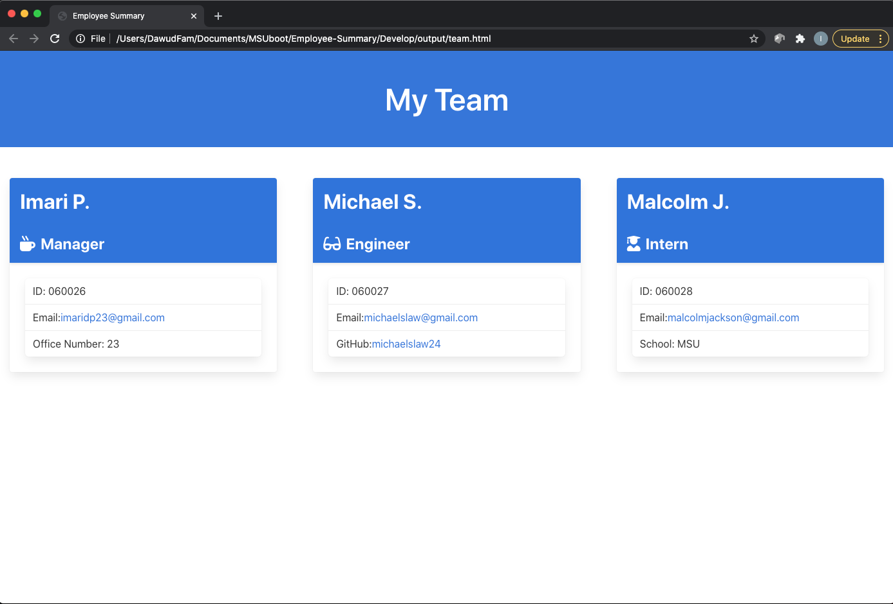
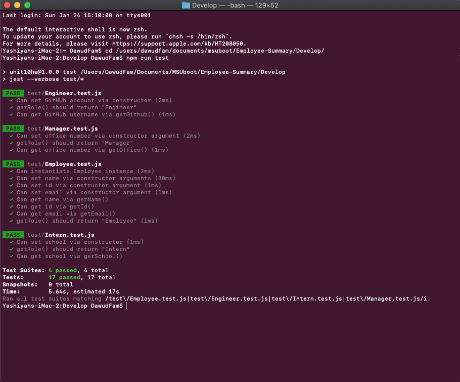

# Employee-Summary
This site was developed with the intention of creating a software engineering team generator command line application that utilizes test driven-development.

## Motivation
The motivation behind this project was to create a Node CLI that gathers user input to generate an employee summary of engineering team members, while using the inquirer and jest dependicies to create the command lines and run provided tests.

## Tech/Framework Used
* HTML
* Bulma CSS
* Node.js (Inquirer & Jest)
* Built with Visual Code Studio

## Code Example
Here is an example of the team summary that is generated with the application:

## Testing
* Jest

## Features
* Command line application
* Test-driven Development

## Installation
Clone this repository to your machine or download zip file.

## Usage
After the repository has been cloned, using your terminal, change directory into the "Develop" folder of the repository and type "node app.js", then press enter. Answer all prompts and then check the "team.html" file in the "output" folder inside "Develop" for your generated team summary.

## License 

> You can reference the full license [here](https://github.com/Picke1id/Employee-Summary/blob/master/LICENSE).

## Link
* Demo URL: (https://drive.google.com/file/d/1FNPZ1pI16HHR4MfTff4dBnAFqBQAJDsb/view)
